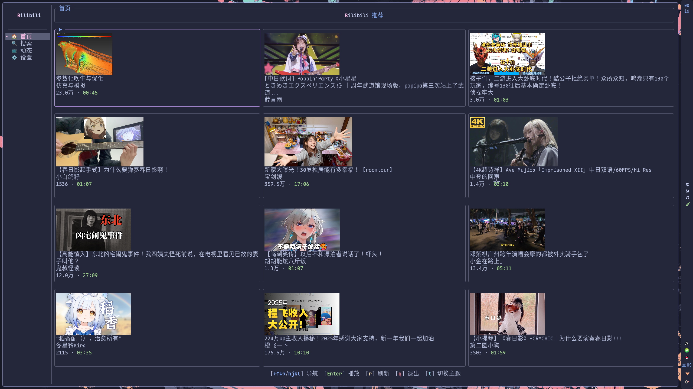
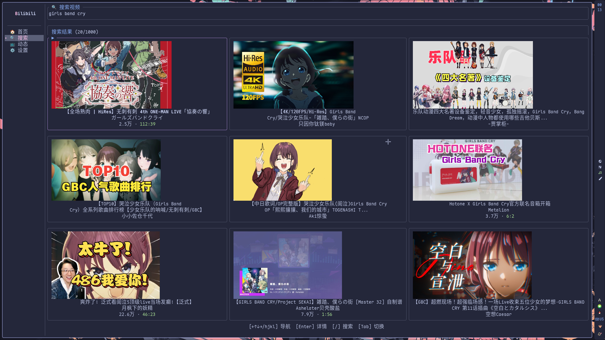
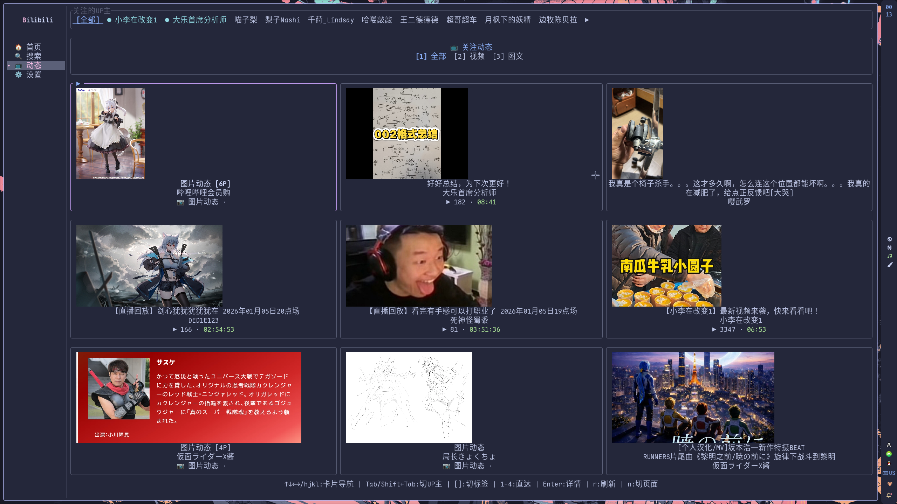
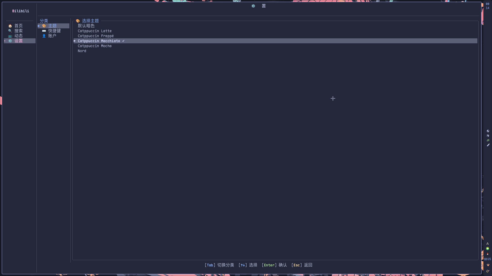

# bilibili-tui

<div align="center">


一个基于终端用户界面（TUI）的 Bilibili 客户端，使用 Rust 构建，提供轻量级且高效的 Bilibili 浏览体验。

[功能特性](#功能特性) • [安装指南](#安装指南) • [使用方法](#使用方法) • [开发指南](#开发指南)

</div>

## 📖 项目简介

bilibili-tui 是一个现代化的终端应用程序，让你能够在终端中舒适地浏览 Bilibili 平台的内容。它采用了 Ratatui 框架构建美观的界面，并集成了完整的 Bilibili API 功能。

### ✨ 核心特点

- 🚀 **高性能**: 基于 Rust 和 Tokio 异步运行时，响应迅速
- 🎨 **美观界面**: 支持多种主题，包括 Catppuccin 系列配色
- 📱 **完整功能**: 支持视频播放、动态浏览、搜索、弹幕等核心功能
- 🔐 **安全认证**: 二维码登录，Cookie 本地持久化存储
- ⌨️ **Vim 风格**: 直观的键位绑定，适合终端用户

## � 应用截图

| 首页                                        | 搜索页                                        |
| ------------------------------------------- | --------------------------------------------- |
|            |            |
| **动态页**                                  | **动态详情**                                  |
|         |  |
| **视频详情**                                | **视频播放**                                  |
|  |   |
| **设置页**                                  |                                               |
|        |                                               |

## �🚀 功能特性

### 🔑 认证系统

- **二维码登录**: 扫描二维码快速登录 Bilibili 账号
- **凭证持久化**: 自动保存登录状态到本地配置目录
- **状态管理**: 实时检测登录状态，自动处理认证过期

### 🏠 浏览功能

- **首页推荐**: 个性化视频推荐网格，支持封面图片预览
- **动态系统**: 浏览关注的 UP 主动态，支持图片和文字动态
- **UP 主门户**: 常看 UP 主快速访问
- **分页加载**: 智能分页，流畅浏览大量内容

### 🔍 搜索功能

- **全文搜索**: 搜索 Bilibili 平台的所有视频内容
- **智能排序**: 支持按热度、时间等多种排序方式
- **结果筛选**: 精确的搜索结果展示
- **分页浏览**: 高效的分页加载机制

### 🎬 视频播放

- **MPV 集成**: 使用强大的 MPV 播放器进行视频播放
- **yt-dlp 支持**: 自动提取和播放 Bilibili 视频流
- **认证播放**: 支持播放会员专属和登录后可见的内容
- **Cookie 同步**: 自动同步登录状态到播放器

### 📝 互动功能

- **评论系统**: 查看视频评论和回复，支持多级评论
- **相关推荐**: 智能推荐相关视频内容
- **动态互动**: 查看和浏览动态详情

### 🎨 主题系统

支持多种精美配色方案：

- **默认暗色**: 经典的暗色主题
- **Catppuccin Latte**: 清新的浅色主题
- **Catppuccin Frappé**: 优雅的深蓝色主题
- **Catppuccin Macchiato**: 温暖的棕色主题
- **Catppuccin Mocha**: 深邃的深色主题
- **Nord**: 北欧风格的冷色调主题

### ⚙️ 设置和定制

- **键位绑定**: Vim 风格的导航键位
- **主题切换**: 实时切换界面主题
- **配置持久化**: 自动保存用户偏好设置
- **账户管理**: 登录/登出账户管理

## 🛠️ 技术栈

- **UI 框架**: [Ratatui](https://github.com/ratatui-org/ratatui) v0.30.0
- **异步运行时**: [Tokio](https://tokio.rs/) (full features)
- **HTTP 客户端**: [reqwest](https://docs.rs/reqwest/) (JSON + cookies)
- **图片处理**: [image](https://docs.rs/image/) crate
- **QR 码生成**: [qrcode](https://docs.rs/qrcode/), [tui-qrcode](https://docs.rs/tui-qrcode/)
- **主题系统**: [catppuccin](https://github.com/catppuccin/rust) (Ratatui feature)
- **开发工具**: [mise](https://mise.jdx.dev/), pre-commit hooks

## 📁 项目结构

```
src/
├── api/          # Bilibili API 交互模块
│   ├── auth.rs   # 二维码认证实现
│   ├── client.rs # 核心 API 客户端
│   ├── video.rs  # 视频信息接口
│   ├── search.rs # 搜索功能接口
│   ├── dynamic.rs # 动态系统接口
│   ├── comment.rs # 评论系统接口
│   ├── recommend.rs # 推荐算法接口
│   └── wbi.rs    # WBI 签名实现
├── app/          # 应用逻辑和状态管理
│   ├── action.rs # 应用动作定义
│   └── mod.rs    # 主应用结构
├── player/       # MPV 播放器集成
│   └── mod.rs    # 播放器控制逻辑
├── storage/      # 数据持久化模块
│   └── mod.rs    # 凭证和配置存储
├── ui/           # UI 组件和页面
│   ├── login.rs  # 登录页面组件
│   ├── home.rs   # 首页推荐组件
│   ├── search.rs # 搜索页面组件
│   ├── dynamic.rs # 动态页面组件
│   ├── video_detail.rs # 视频详情组件
│   ├── dynamic_detail.rs # 动态详情组件
│   ├── settings.rs # 设置页面组件
│   ├── sidebar.rs # 侧边栏导航
│   ├── theme.rs  # 主题系统实现
│   └── video_card.rs # 视频卡片组件
├── lib.rs        # 模块声明
└── main.rs       # 应用程序入口
```

## 🚀 安装指南

### 前置要求

#### 系统依赖

- **Rust 工具链**: 稳定版 (stable)
- **Cargo**: Rust 包管理器

#### 外部工具

- **MPV**: 强大的视频播放器

  ```bash
  # Ubuntu/Debian
  sudo apt install mpv

  # macOS
  brew install mpv

  # Arch Linux
  sudo pacman -S mpv
  ```

- **yt-dlp**: 视频提取工具（MPV 内置支持）

  ```bash
  # Ubuntu/Debian
  sudo apt install yt-dlp

  # macOS
  brew install yt-dlp

  # Arch Linux
  sudo pacman -S yt-dlp
  ```

- **MPV Bilibili 弹幕**

  请参考[MPV-Play-BiliBili-Comments](https://github.com/itKelis/MPV-Play-BiliBili-Comments)

#### 推荐终端

支持以下终端图形协议以获得最佳图片预览体验：

- **Kitty**: graphics protocol
- **Sixel**: 图形协议支持
- **iTerm2**: graphics protocol
- **其他终端**: 将自动回退到 ASCII 艺术模式

### 安装方法

#### 方法一：从 AUR 安装（Arch Linux 推荐）

对于 Arch Linux 用户，推荐通过 AUR 安装预编译的二进制包：

```bash
# 使用 yay
yay -S bilibili-tui-bin

# 或使用 paru
paru -S bilibili-tui-bin
```

> 这是 Arch Linux 用户最便捷的安装方式，无需手动编译，自动处理依赖关系。

#### 方法二：使用 Cargo

```bash
# 克隆仓库
git clone https://github.com/maredevi/bilibili-tui.git
cd bilibili-tui

# 构建发布版本
cargo build --release

# 运行应用
./target/release/bilibili-tui
```

#### 方法三：从源码编译（开发版本）

```bash
# 从 git 仓库克隆并构建
git clone https://github.com/maredevi/bilibili-tui.git
cd bilibili-tui
cargo install --path .
```

> 注意：当前版本尚未发布到 crates.io

#### 方法四：使用 mise（推荐用于开发）

```bash
# 安装 mise（如果未安装）
# macOS: brew install mise
# Linux: 参考官方文档 https://mise.jdx.dev/

# 克隆仓库
git clone https://github.com/maredevi/bilibili-tui.git
cd bilibili-tui

# 安装项目依赖
mise install

# 构建
mise exec cargo build

# 运行
mise exec cargo run
```

## 📖 使用方法

### 键位绑定

应用采用 Vim 风格的键位绑定，熟悉 Vim 的用户可以快速上手：

| 功能           | 键位                | 说明                                                                          |
| -------------- | ------------------- | ----------------------------------------------------------------------------- |
| **导航**       |                     |                                                                               |
| 向上移动       | `k` / `↑`           | 在列表中向上移动                                                              |
| 向下移动       | `j` / `↓`           | 在列表中向下移动                                                              |
| 向左移动       | `h` / `←`           | 向左导航                                                                      |
| 向右移动       | `l` / `→`           | 向右导航                                                                      |
| **操作**       |                     |                                                                               |
| 确认选择       | `Enter`             | 打开选中项                                                                    |
| 返回上级       | `Esc`               | 返回上一页面                                                                  |
| 退出应用       | `q`                 | 退出程序                                                                      |
| 播放视频       | `p`                 | 播放选中的视频                                                                |
| 刷新页面       | `r`                 | 刷新当前页面内容                                                              |
| 切换主题       | `t`                 | 循环切换主题                                                                  |
| 打开设置       | `s`                 | 打开设置页面                                                                  |
| **搜索**       |                     |                                                                               |
| 开始搜索       | `/` 或 `i`          | 进入搜索输入模式                                                              |
| **页面切换**   |                     |                                                                               |
| 切换页面       | `Tab`               | 首页/搜索页-切换页面；动态页-切换 UP 主；设置页-切换分类；视频详情页-切换焦点 |
| **动态页**     |                     |                                                                               |
| 切换动态标签   | `[` / `]`           | 在全部/视频/图文标签间循环切换                                                |
| 快速切换标签   | `1` / `2` / `3`     | 快速跳转到全部/视频/图文标签                                                  |
| 切换 UP 主     | `Tab` / `Shift+Tab` | 在常看 UP 主列表中切换                                                        |
| **视频详情页** |                     |                                                                               |
| 切换焦点       | `Tab`               | 在评论和相关推荐区域间切换                                                    |
| 展开收起回复   | `r`                 | 展开/收起评论回复                                                             |

### 页面导航

应用采用侧边栏导航设计，包含以下主要页面：

#### 🏠 首页

- 显示个性化推荐视频
- 支持封面图片预览
- 自动分页加载更多内容

#### 🔍 搜索页

- 输入关键词搜索视频
- 显示搜索结果列表
- 支持分页浏览更多结果

#### 📱 动态页

- 浏览关注的 UP 主动态
- 支持多种动态类型（视频、图文、纯文字）
- **标签切换**：按 `[` / `]` 在全部/视频/图文标签间切换
- **快速访问**：按 `1` / `2` / `3` 快速跳转到对应标签
- **UP 主导航**：按 `Tab` / `Shift+Tab` 切换常看 UP 主
- 快速访问常看 UP 主列表

#### ⚙️ 设置页

- 查看和修改键位绑定
- 切换界面主题
- 账户管理（登出功能）

#### 🎬 视频详情页

- 查看视频信息和评论区
- 支持相关推荐
- **焦点切换**：按 `Tab` 在评论和相关推荐区域间切换
- **评论操作**：按 `r` 展开/收起回复

### 主要功能说明

#### 二维码登录流程

1. 启动应用后自动显示登录页面
2. 使用 Bilibili 手机客户端扫描二维码
3. 确认登录后自动保存凭证到本地
4. 登录成功后跳转到首页

#### 视频播放

1. 在视频列表中选择视频
2. 按 `p` 键或回车键打开视频详情
3. 在视频详情页面按 `p` 键启动播放
4. 使用 MPV 播放器播放视频内容

#### 图片预览

- 支持的终端协议：Kitty、iTerm2、Sixel
- 自动检测终端能力
- 不支持时回退到 ASCII 艺术

## ⚙️ 配置说明

### 配置文件位置

配置文件存储在用户配置目录：

```
~/.config/bilibili-tui/
├── credentials.json  # 登录凭证
├── config.json      # 应用配置
└── cookies.txt      # 临时 cookies 文件（播放视频时生成）
```

> `cookies.txt` 文件在播放视频时自动生成，用于 MPV/yt-dlp 认证

### 配置文件格式

#### `credentials.json`

```json
{
  "sessdata": "your_sessdata_token",
  "bili_jct": "your_bili_jct_token",
  "dede_user_id": "your_user_id",
  "dede_user_id_ckmd5": "optional_md5_hash",
  "refresh_token": "optional_refresh_token"
}
```

#### `config.json`

```json
{
  "theme": "CatppuccinMocha",
  "keybindings": {
    "quit": "q",
    "nav_up": "k",
    "nav_down": "j",
    "nav_left": "h",
    "nav_right": "l",
    "confirm": "Enter",
    "back": "Esc",
    "next_theme": "t",
    "play": "p",
    "refresh": "r",
    "open_settings": "s"
  }
}
```

### 主题配置

支持的主题变体：

- `"Default"` - 默认暗色主题
- `"CatppuccinLatte"` - Catppuccin 浅色主题
- `"CatppuccinFrappé"` - Catppuccin Frappé 主题
- `"CatppuccinMacchiato"` - Catppuccin Macchiato 主题
- `"CatppuccinMocha"` - Catppuccin Mocha 主题
- `"Nord"` - Nord 主题

## 🏗️ 架构说明

### 设计模式

- **事件驱动**: UI 组件返回 `AppAction`，中央处理器统一处理
- **异步 I/O**: 所有 API 调用和 I/O 操作都是异步的
- **组件化 UI**: 每个页面实现 `Component` trait
- **状态管理**: 集中式状态管理，支持状态持久化

### 模块交互流程

```
main.rs → App::run() → 事件循环 → UI 组件 → AppActions → App::handle_action()
                                    ↓
                            API 客户端 ← Storage (凭证/配置)
                                    ↓
                            播放器 (外部 MPV)
```

### API 安全

- **用户代理**: 使用标准 Chrome 用户代理
- **Referer 头**: 始终包含 bilibili.com referer
- **WBI 签名**: 搜索和推荐 API 的强制签名机制
- **速率限制**: 通过正确的 API 使用模式实现隐式速率限制

## 🧪 开发指南

### 开发环境设置

#### 1. 克隆仓库

```bash
git clone https://github.com/maredevi/bilibili-tui.git
cd bilibili-tui
```

#### 2. 安装开发依赖

```bash
# 使用 mise（推荐）
mise install

# 或手动安装 Rust
curl --proto '=https' --tlsv1.2 -sSf https://sh.rustup.rs | sh
```

#### 3. 设置 Pre-commit Hooks

```bash
# 安装 git hooks
pre-commit install

# 手动运行检查
pre-commit run --all-files
```

### 开发工作流

#### 常用命令

```bash
# 代码检查
cargo check

# 格式化代码
cargo fmt

# 代码 Lint
cargo clippy -- -D warnings

# 运行测试
cargo test

# 构建项目
cargo build

# 构建发布版本
cargo build --release

# 运行应用
cargo run
```

#### Pre-commit 配置

项目配置了以下 pre-commit hooks：

- **代码格式**: `rustfmt` 自动格式化
- **语法检查**: `cargo check` 快速检查
- **代码质量**: `clippy` 高级 lint
- **构建测试**: `cargo build` 确保可构建
- **单元测试**: `cargo test` 运行测试

### 调试技巧

#### 启用调试日志

```bash
RUST_LOG=debug cargo run
```

#### 常见问题

1. **图片不显示**: 检查终端是否支持图形协议
2. **播放失败**: 确认 MPV 和 yt-dlp 已正确安装
3. **登录失败**: 检查网络连接和防火墙设置

## 🤝 贡献指南

我们欢迎所有形式的贡献！请遵循以下步骤：

### 贡献流程

1. Fork 本仓库
2. 创建功能分支 (`git checkout -b feature/amazing-feature`)
3. 提交更改 (`git commit -m 'Add amazing feature'`)
4. 推送到分支 (`git push origin feature/amazing-feature`)
5. 创建 Pull Request

### 代码规范

- 遵循 Rust 官方代码风格
- 使用 `cargo fmt` 格式化代码
- 通过 `cargo clippy` 检查
- 添加适当的单元测试
- 更新相关文档

### Issue 报告

使用 GitHub Issues 报告问题，请包含：

- 详细的问题描述
- 复现步骤
- 环境信息（操作系统、终端等）
- 错误日志（如有）

## 📄 许可证

MIT License

## 🙏 致谢

感谢以下开源项目的支持：

- [Ratatui](https://github.com/ratatui-org/ratatui) - 现代化的 Rust TUI 框架
- [Tokio](https://tokio.rs/) - 异步运行时
- [Catppuccin](https://github.com/catppuccin/catppuccin) - 优雅的配色方案
- [MPV](https://mpv.io/) - 强大的媒体播放器
- [yt-dlp](https://github.com/yt-dlp/yt-dlp) - 视频下载工具
- [MPV-Play-BiliBili-Comments](https://github.com/itKelis/MPV-Play-BiliBili-Comments) - MPV Bilibili 弹幕
- [bilibili-API-collect](https://github.com/SocialSisterYi/bilibili-API-collect) - Bilibili API 集合

## 📞 联系方式

- 项目主页: [GitHub Repository](https://github.com/maredevi/bilibili-tui)
- 问题反馈: [GitHub Issues](https://github.com/maredevi/bilibili-tui/issues)
- 功能请求: [GitHub Discussions](https://github.com/maredevi/bilibili-tui/discussions)

---

<div align="center">

**🌟 如果这个项目对你有帮助，请给个 Star 支持！**

Made with ❤️ by MareDevi

</div>
